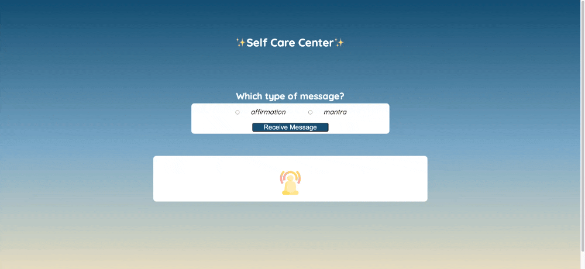

# ✨ Self-Care Center ✨

## Abstract:

`Self Care Center` allows users to receive positive and uplifting messages based on the two selections provided. The user will see a random message once from a list of messages. After the user cycles through all the messages in the list, the background where the messages are displayed will turn `blue`. Once the background turns `blue`, the user is notified with a message that says `You will now see repeating messages.`

## Installation Instructions:

1. Select the `fork` button on the top right corner.
2. In `your terminal`, decide where you want to clone this repo.
3. Select the `code` button and copy the SSH.
4. In your terminal type git clone and paste the SSH.
5. `git clone git@github.com:ZTFitru/self-care-center.git`
6. `cd` into the directory.
7. If you are using `Visual Studio Code` use `code .` to run it.
8. To view, use `open.html` in the terminal.

## Preview of App:

## Context:

- This was a solo project I completed on week 3, while attending at Turing. I was tasked to recreate what the app would look like from a screenshot image provided. I was also provided with the fonts, colors and an image. This project was to test my understanding of HTML, CSS and JavaScript. HTML and CSS helped me bring out the visual aspect of the page and I used JS to make it interactive for the user. 

## Contributors:

[Zelalem Fitru](https://github.com/ZTFitru)

## Learning Goals:

- Hands-on experience in developing an application using HTML, CSS, and JavaScript .
- Create HTML and CSS to align with a given design.
- Understand how to handle and respond to user events effectively.

## Wins + Challenges:

* Wins:
    - Using `Devtools` to adjust and make my page match the image provided.
    - Watching the JS code I wrote be interactive.

* Challenges:
    - Reaseraching how to use the radio type in an input element.
    - How to make the messages appear center without affecting the budda image. 

##

 

 

 

 

 

 

 

 
